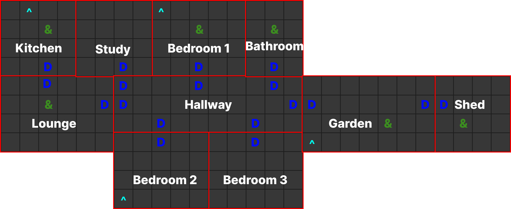

# **The Dukes** <br/>
#### *A murder mystery game.*
<br/>
<br/>

## **Introduction**
This is a murder mystery game where you are dropped into The Dukes house. You are required to figure out who commited the murder by talking to characters and using items.

## **User Documentation**
### Installation Steps
1. Download all files from this Github Repo. <br/>
2. Install colorama to your Python libraries by entering ```pip install colorama``` in your python console.
3. Once colorama is installed within the 'app' folder find 'main.py'
4. You will then run 'main.py' in the python terminal to start up the game.

## Note
This game has been created in Visual Studio Code however issues with Jetbrains have become apparent. <br/>
Edits have been made to allow function in JetBrains however functionality is not as smooth.

### Game play
To play this game you will be required to type inputs and press the <kbd>enter</kbd> key. <br/>
These inputs will be described to you through the game as either interaction options or pre-set inputs, these inputs are described below in the 'User Input Key's section.

### Map

### Icon Legend
<span style="color:blue">D</span> - Door <br/>
<span style="color:cyan">^</span> - Item <br/>
<span style="color:green">&</span> - NPC <br/>
<span style="color:magenta">@</span> - Player <br/>

### Game Play Input Key's
<kbd>h</kbd> - Opens Help Menu <br/>
<kbd>i</kbd> - Opens Inventory Menu<br/>
<kbd>m</kbd> - Opens Map Menu <br/>
<kbd>0</kbd> or <kbd>1</kbd> or <kbd>2</kbd> or <kbd>3</kbd> - Option Inputs <br/><br/>

## **Developer Documentation**
### Class Diagram
